# CSCI596 Final Project

Implementation of a rea-time image object detector [YOLO](https://pjreddie.com/media/files/papers/YOLOv3.pdf) that supports parallel computing(CUDA) using PyTorch and OpenCV.

## Team Members

* Tianyue Fan
* Linhua Chen

## Dependencies

1. Python 3.5 and above
2. PyTorch 0.4 and above
3. OpenCV
4. [Pretrained weights file](https://pjreddie.com/media/files/yolov3.weights) for COCO dataset

## Executing Program

If your machine has CUDA enabled, the model will run on the GPU, which will be much faster than using CPU to make detections.
```
python detector.py --images <path to the image> --det <directory to store detection results>
```
Other optional arguments includes:

`--bs` defines the batch size, default is 1

`--confidence` defines the object confidence to filter predictions, default is 0.5

`--nms_thresh` defines the non-maximum suppression threshold, default is 0.4

`--cfg` defines the path to the configuration file, default is `cfg/yolov3.cfg`

`--weights` defines the path to the weights file, default is `yolov3.weights`

`--reso` defines the input resolution of the model, default is 416

## How Does the Detector Work

### 1. Image Division into Grids

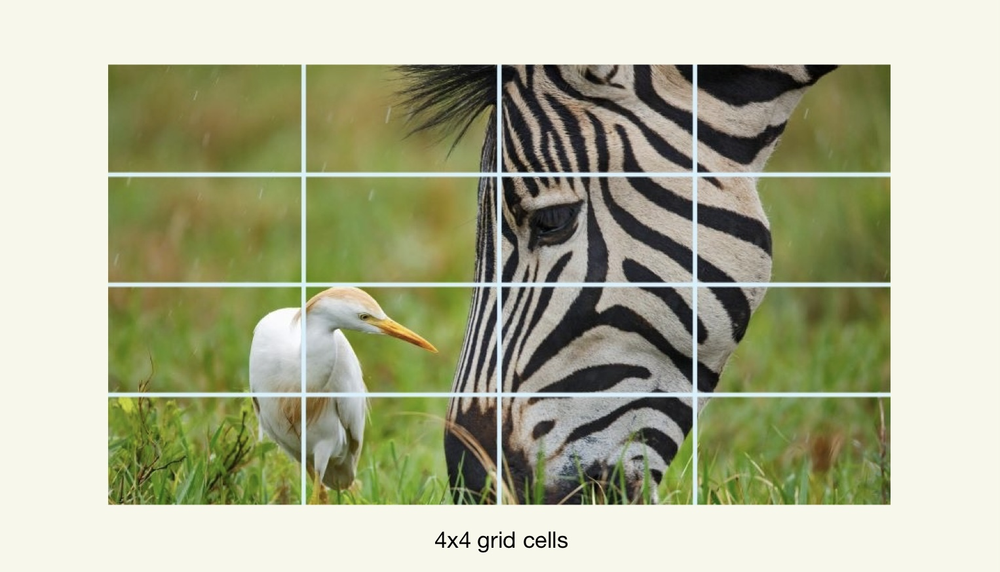

### 2. Bounding Box Predictions

For each box, YOLO calculates 3 things:
1. Coordinates
2. Width and height
3. Confidence score

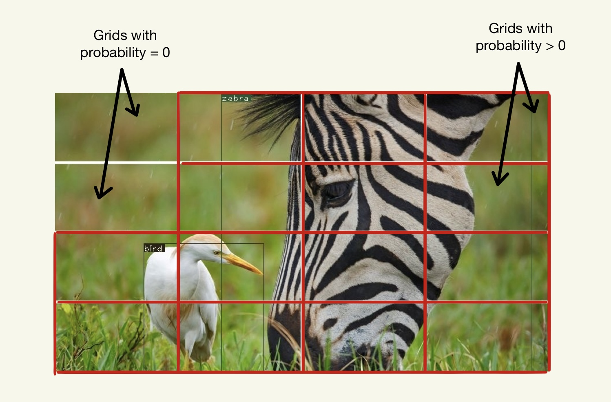

### 3. Class Probabilities

### 4. Non-Maximum Suppression (NMS)

NMS works in 2 parts:
1. Sorting all bounding boxes by their confidence scores.
2. Removing boxes with high overlap, measured by Intersection over Union (IoU)

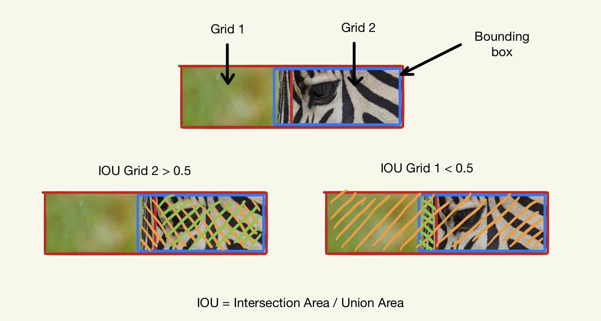

## Detection Result Examples

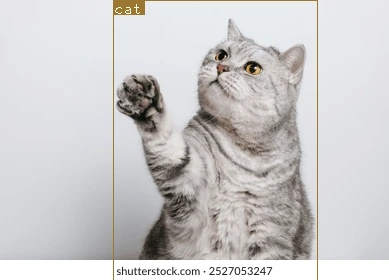

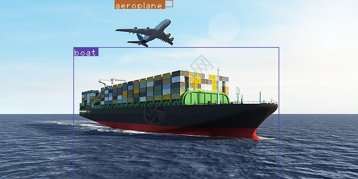

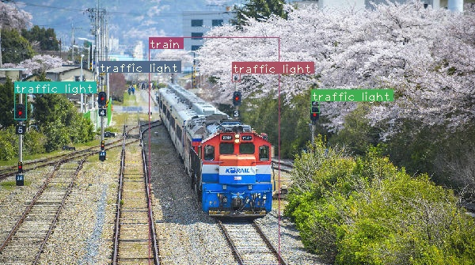

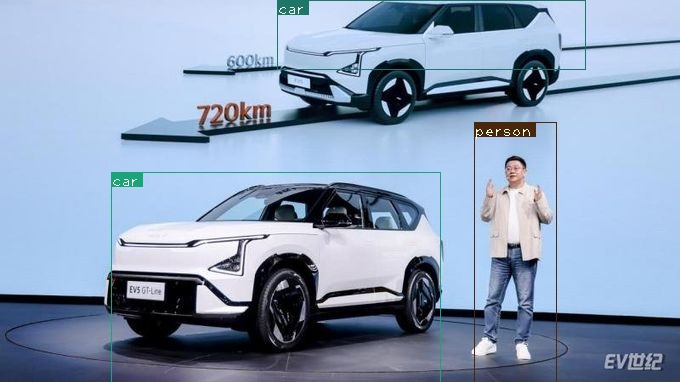

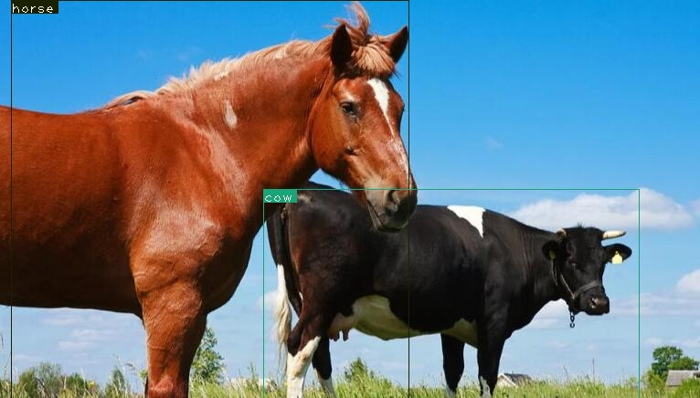

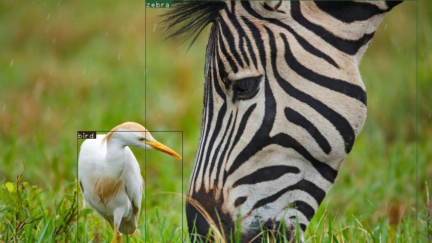

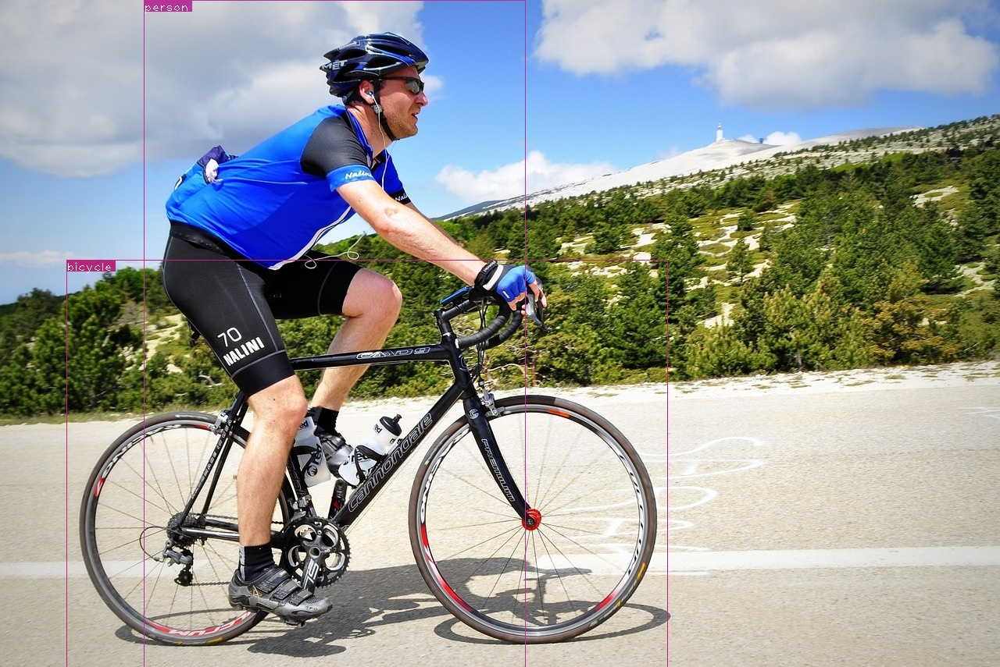

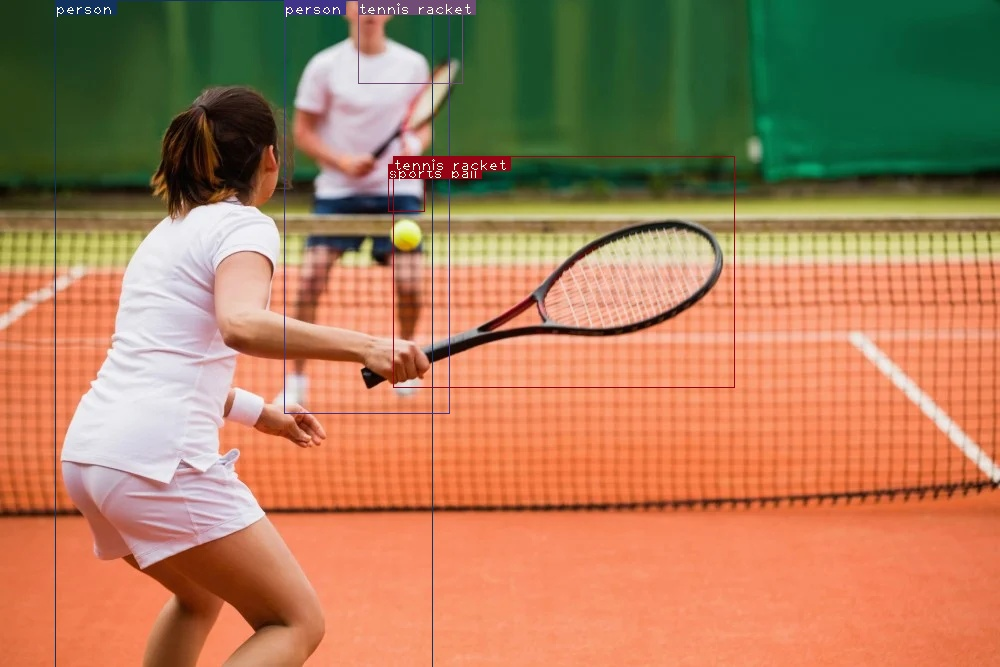